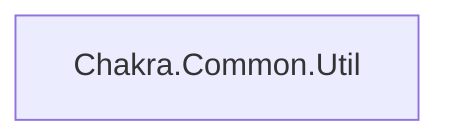

# Dependency Graph

Remaining:
- Chakra.JITClient
- Chakra.JITIDL
- Chakra.JITServer
- Chakra.Jsrt
- Chakra.Jsrt.Core
- Chakra.Backend
- Chakra.Common.Codex
- Chakra.Common.Common
- Chakra.Common.Core
- Chakra.Common.DataStructures
- Chakra.Common.Exceptions
- Chakra.Common.Memory
- Chakra.Parser
- Chakra.Runtime.Base
- Chakra.Runtime.PlatformAgnostic
- Chakra.Runtime.ByteCode
- Chakra.Runtime.Debug
- Chakra.Runtime.Language
- Chakra.Runtime.Library
- Chakra.Runtime.Math
- Chakra.SCACore
- Chakra.WasmReader
- wabt
- Chakra.Runtime.Types
- Chakra.ICU.Common
- Chakra.ICU.i18n
- Chakra.ICU.Data
- ChakraCore
- ch
