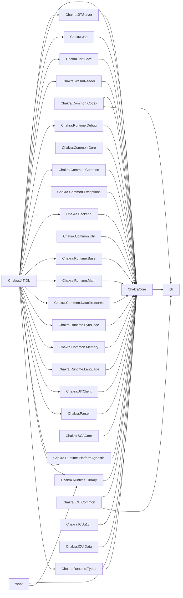

# Dependency Graph

```mermaid
graph LR
    Chakra.JITClient --> ChakraCore
    Chakra.JITIDL --> ChakraCore
    Chakra.JITServer --> ChakraCore
    Chakra.Jsrt --> ChakraCore
    Chakra.Jsrt.Core --> ChakraCore
    Chakra.Backend --> ChakraCore
    Chakra.Common.Codex --> ChakraCore
    Chakra.Common.Common --> ChakraCore
    Chakra.Common.Core --> ChakraCore
    Chakra.Common.DataStructures --> ChakraCore
    Chakra.Common.Exceptions --> ChakraCore
    Chakra.Common.Memory --> ChakraCore
    Chakra.Common.Util --> ChakraCore
    Chakra.Parser --> ChakraCore
    Chakra.Runtime.Base --> ChakraCore
    Chakra.Runtime.PlatformAgnostic --> ChakraCore
    Chakra.Runtime.ByteCode --> ChakraCore
    Chakra.Runtime.Debug --> ChakraCore
    Chakra.Runtime.Language --> ChakraCore
    Chakra.Runtime.Library --> ChakraCore
    Chakra.Runtime.Math --> ChakraCore
    Chakra.SCACore --> ChakraCore
    Chakra.WasmReader --> ChakraCore
    wabt --> ChakraCore
    Chakra.Runtime.Types --> ChakraCore
    Chakra.ICU.Common --> ChakraCore
    Chakra.ICU.i18n --> ChakraCore
    Chakra.ICU.Data --> ChakraCore
    Chakra.JITIDL --> Chakra.JITServer
    ChakraCore --> ch
    Chakra.ICU.Common --> ch
    Chakra.Common.Codex --> ch
    Chakra.JITIDL --> Chakra.Jsrt
    Chakra.JITIDL --> Chakra.Jsrt.Core
    Chakra.JITIDL --> Chakra.WasmReader
    Chakra.JITIDL --> Chakra.Runtime.Debug
    Chakra.JITIDL --> Chakra.Common.Common
    Chakra.JITIDL --> Chakra.Backend
    Chakra.JITIDL --> Chakra.Runtime.Base
    Chakra.JITIDL --> Chakra.Runtime.Math
    Chakra.JITIDL --> Chakra.Common.DataStructures
    Chakra.JITIDL --> Chakra.Runtime.ByteCode
    Chakra.JITIDL --> Chakra.Common.Memory
    Chakra.JITIDL --> Chakra.Runtime.Language
    Chakra.JITIDL --> Chakra.JITClient
    Chakra.JITIDL --> Chakra.Parser
    Chakra.JITIDL --> Chakra.Runtime.Library
    wabt --> Chakra.Runtime.Library
    Chakra.JITIDL --> Chakra.Runtime.PlatformAgnostic
    Chakra.JITIDL --> Chakra.Runtime.Types
```